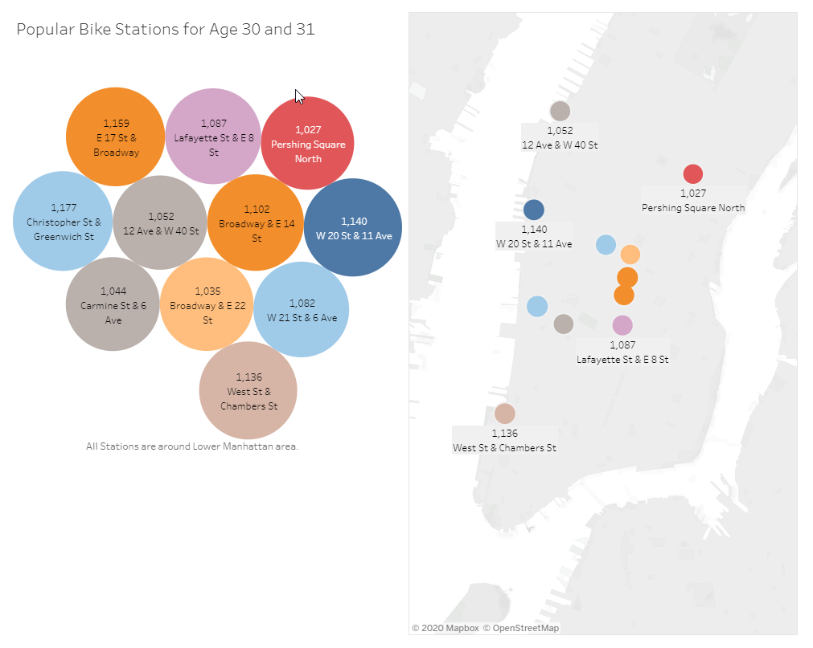

# NYC Citi Bike Analysis 

### Tableau Public URL

[CitiBike Dashboard](https://public.tableau.com/profile/kha.t.nguyen#!/vizhome/Citibikes_15872526301380/Challenge14)

### Summary 

A bicycle-sharing system is a service in which people can rent a bicycle for short-time period. The bike share system is now more popular for people in living or working in the metropolis downtowns not only in United States, but also around the world. The bike share is a trend and an opportunity that local city governments want to support and to invite business organizations to do business because the bike share brings to many good benefits such as: to reduce Carbon Dioxin, traffic, and accident as well as  to promote public health. Citi bike, one of bicycle share service in New York city, is a successful running business in the Great Manhattan Downtown New York. We will use the data of Citi bike in New York to analyze if it is good to open a bike share in Des Moines downtown, Iowa. We will look in the gender diversity to do our data analysis.

### Introduction

- The collection information of Census Information in 2018 from census government website [https://www.census.gov/quickfacts/fact/table/newyorkcitynewyork,desmoinescityiowa/PST045219](https://www.census.gov/quickfacts/fact/table/newyorkcitynewyork,desmoinescityiowa/PST045219) and [https://www.catchdesmoines.com/things-to-do/](https://www.catchdesmoines.com/things-to-do/)

1.	Let us Look at the numbers. New York population is about 8.4 million, male is about 4.0 million, and female is about 4.4 million. Income age (18-65) is about 5.5 million While Des Moines is much less in population about 0.2 million, male and female are respectively about 0.1 million and 0.1 million. And income age (18-65) is about 0.14 million. These numbers are so different to do a comparation between two cities because New York is a major metropolis city in the world and Des Moines is a regular city like other cities in the United States

2.	However, if we look at the percent numbers, then we find out that both cities are the same characters of population, genders, and income age. So, it should be a good candidate city for the bike share business.

The picture below the census table shows more features of New York and Des Moines. This is from datausa.io website [https://datausa.io/profile/geo/des-moines-ia/?compare=new-york-ny#demographics](https://datausa.io/profile/geo/des-moines-ia/?compare=new-york-ny#demographics) . If you are interested in learning more the facts of Des Moines, then just follow the link.

- The sky view geography of the two cities [https://google.com/maps](https://google.com/maps). This gave a general idea about the business central locations

### Begin the data analysis

Let us start to do data analysis of Citibike data August 2019 of New York. The August data regularly the good month data for Citibike business in New York.

### Bike by Genders

The total numbers of bike share rides were checked out from station is 2.3 million while the male gender check-out ratio is 65.28% (1.5 million) and the female is 25% (0.5 million). We should disregard the unknown gender for now because we are only considered male and female genders. We need to break these numbers down because New York is a major tourist spot. 

1. Customer type: Short-term customers. They can be tourist people or local people who does not a long-term membership. The Customers by Genders Pie chart has about 0.44 million. It is about one sixth of the total rides. However, this number may not consistent month to month because it depends on tourist seasons.

2. Subscriber type: Long-term customers. They are local people who need to often use the bike share service. We need to investigate this type breakdown because it is truly customer type of the business. The Subscribers by Genders Pie chart has about 1.9 million subscribers. It is about five sixth of the total rides. The percent of male rides is 72.23% and female is 25.98%. If we convert the percent numbers for Moines, then 77,063 possible rides are for male gender, 28,619 possible rides are for female gender and total possible rides is 105,682. This number compare to Population of Des Moines is about 50% or 1 in 2 people might use the service one in a month.

### Bike by Ages and Genders

The shadow chart shows the income age between 18 – 65. We can see that male of all ages using the bike share service more than female. And we can recognize age range between 22 and 43 for both genders use the most bike share service. Des Moines is about 63.80% or 138,352 people between 18 to 65 and number male and female are very balance. This is a young population so the bike share service might be a great opportunity.

### Popular Bike Stations for Age 30 and 31

The previous chart peaks of both genders around age 30 and 31. Male is the peak at age 30 and female is the peak at age 31. The Popular Bike Stations for Age 30 and 31 Circle chart and Map chart show the most popular stations they regular use. The locations can divide into two types. One is border of the city New York and New Jessey and other is in the Manhattan business downtown. This can give us a hind to place bike share stations in Des Moines city.

### Where are they biking of both genders and Age (next two slices) 

We can see clearly that both genders and age are actively to use the bike share service in the great Manhattan downtown. The downtown is a place attractive all businesses and services as well as landmarks. It is the place for people’s workplaces and visit. If we apply this model to Des Moines city, the bike stations need to be placed in the downtown where people work, and people visit as well as restaurant or rails metro.
